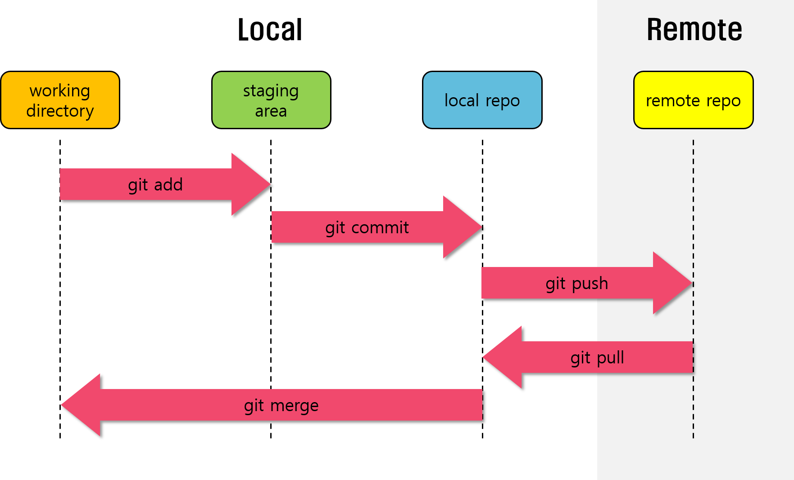
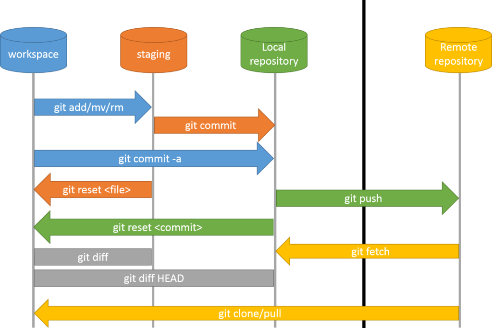

# Git

Buenas prácticas con GIT

## Primeros pasos

### Configuración

https://gitforwindows.org/

https://git-scm.com/downloads

```bash
git config --global user.name "[firstname lastname]"
git config --global user.email "[valid-email]"
git config --global credential.helper wincred
git config --global --list
```

### Inicialización

```bash
mkdir improving
cd improving
git init
git status
```

### Edición de ficheros y staging area

```bash
# crear y modificar fichero curso.md
git add ./curso.md # incorporar fichero al control de código
git status
# modificar fichero curso.md
git status
git add ./curso.md # incorporar cambios del fichero al control de código
git status
# modificar con un error
git status
git checkout -- ./curso.md # deshacer cambios en curso.md
git status
git reset ./curso.md # sacar de git el fichero curso.md
git status
git add * # volver a añadir el fichero y cualquier otro
git diff # ver cambios no incorporados
:q # para salir
```



### Ignorar ficheros

`.gitignore`

```txt
node_modules/
logs/
.vscode/
```

### Cometer, comprometer, guardar los cambios

```bash
git commit -m "feat: primeros pasos" # Guardar cambio con un propósito
git log # ver historial de cambios comprometidos
git show curso.md # ver cambios de un fichero
```
> Cada _commit_ tiene un identificador único

```bash
git rev-parse HEAD # Obtener id del útlimo commit
```

### Convenio de Mensajes

[conventional Commits](https://www.conventionalcommits.org/en/v1.0.0/)


- fix: Para arreglos de errores (avanza versión patch) #issueID

- feat: Para agregar funcionalidad (avanza versión minor) #issueID

- fix|feat!: Cambios rupturistas (avanza versión major) #issueID

- refactor: Cambios internos que no afectan al uso

- docs: documentación de soporte

- test: pruebas

- chore : Para cambios en editor o configuración

- wip(scope): Cambio realizado #issueID

#### Change log

`pacakge.json`
```json
{
  "scripts": {
    "release": "standard-version"
  }
}
```

```bash
npm init
npm i --save-dev standard-version
git add *
git commit -m 'chore: add standard version to commits'
npm run release
```

> Genera un CHANGELOG.md y etiqueta los commits


## Ramas


### Crear y moverse a otra rama

```bash
git add *
git commit -m 'feat: previo a crear rama'
git branch # lista de ramas
git branch enlaces # crea la rama, pero NO se cambia
git commit -am 'feat: previo a mover a rama' # -am hace add y commit
git checkout enlaces # cambio de rama
```

### Realizar cambios

```bash
# Crear fichero de enlaces.md
git add *
git commit -m 'feat: enlaces de interés'
# realizar cambios
git commit -am 'feat: previo a volver a master'
```

### Integrar los cambios

```bash
git checkout master # cambiar a la rama master
git merge enlaces # mezclar los cambios de la otra rama
```

### Borrar ramas

```bash
git branch -d enlaces
```

> Hay un corriente promovida por BLM para cambiar _master_ por _main_

## Integración remota



### Agregar repositorio remoto

```bash
git remote add origin https://github.com/LabsAdemy/improving.git # alias url
```

> Se suele usar el alias _origin_

### Enviar cambios

```bash
git push origin master # alias rama
```

### Obtener cambios

```bash
git commit -am 'feat: previo pull' # siempre un commit previo
git pull origin mater
```

```bash
git push -u origin master # -u asigna el _upstream_ por defecto
git pull # comprobar novedades sin alias ni rama
git add *
git commit -m 'feat: sin especificar origen remoto'
git push
git pull
```

## Gestión de problemas

Hay dos tipos de problemas:

- Querer volver a una versión anterior
- Conflictos en las mezclas

### Viajar por el tiempo local

```bash
# crear fichero time.md y agregarlo
git commit -am 'feat: fichero time iniciado'
git commit -am 'feat: fichero time cambiado'
git commit -am 'feat: fichero time re cambiado'
git commit -am 'docs: time travel'
```

```bash
# ver historial
git log master --oneline # para ver acciones
# viajar por el tiempo sin intervenir
git checkout a2352e4
git checkout 010f707
# volver al presente
git checkout master
```

### Cambiando la historia

```bash
# cambiar time
git commit -am 'feat: un buen cambio'
# meter un mal cambio
git commit -am 'feat: un muy mal cambio'
# buscar
git log master --oneline
# resetear hacia atrás, perdiendo los siguientes cambios
git reset --hard 5b4eb89
git commit -am 'docs: cambiando la historia en local'
```

### Con el remoto

Viajar en el tiempo esencialmente es lo mismo.

- 1 Primero descargas _pull_ la rama que quieras.

- 2 Después te mueves por sus _commits_

- 3 Si cambias algo será en local.

- 4 Si todo queda arreglado, se sube con _push_.


### Conflictos

Se producen al mezclar contenido entre ramas o entre distintos orígenes.

Lo primero es tratar de evitarlos con estos consejos:

- Mezclado frecuente, para reducir la cantidad de cambios a mezclar

- Commits atómicos para arreglar más fácilmente los problemas


Pero inevitablemente se acabarán produciendo.

### Resolución de conflictos

Las herramientas puede ayudar, pero al final quedarán caso para resolver manualmente.

Por ejemplo, hemos incorporado un librería de estilos que en la otra rama/origen no se contemplaba:

```html
<html>
  <head>
<<<<<<< HEAD
    <link rel="stylesheet" href="style.css" />
=======
    <!-- no style -->
>>>>>>> master
  </head>
  <body>
    <h1>Hello,World! Life is great!</h1>
  </body>
</html>
```

La sintaxis es un poco rara. Son **siete** símbolos <, = y >

**<<<<<<<** _Inicio de nuestro cambio_

**=======** _Separador de cambios_

**>>>>>>>** _Fin del cambio externo_


Nadie mejor que tú para saber cual es el cambio bueno. Al terminar hay que certificar el cambio , documentarlo, y guardarlo en el origen.

```bash
git status # nos informa de los conflictos
git log --merge # indica los commits conflictivos
git diff # ayuda a ver diferencias de contenido
# solución manual
git checkout # puede requerir viaje en el tiempo
git reset # puede ser necesario descartar nuestros cambios
git merge --abort # para la mezcla y busca ayuda o estrategia
# si todo va bien
git commit -m 'merge: explicación'
git push
```

## Utilidades

### Congelar cambios temporales

Si tienes cambios sin comprometer, y necesitas cambiar de rama o de origen... se perderán esos cambios.

La solución es guardarlo de forma temporal.

```bash
git stash save 'mensaje para rastreo' # guarda cambios pendientes
git stash aply # aplica (restaura) los cambios
# si hay muchos cambios puedes ir paso a paso
git stash list # pila de ficheros congelados
git stash pop # aplica el primer cambio de la pila
git stash drop # descarta el primer cambio de la pila
```

### Modificar último commit

Si hay un pequeño fallo o un olvido no es necesario crear un nuevo _commit_

```bash
git commit --amend --no-edit # sin modificar el mensaje
git commit --amend -m 'cambio' # cambiando el mensaje
```

### Cambiar la base

Es justo el cometido del comando más intimidante _rebase_.


Estando en una rama cualquiera, podemos re ejecutar (como si fuera una grabación) los cambios que hemos hecho... pero partiendo de la base de otra rama.

```bash
git rebase master # aplica mis cambios a partir del master
```

Normalmente la otra rama es el origen remoto. De esta forma lo cambios que aportamos se aplican al contenido actual del otro como si se los hubiésemos aplicado uno a uno manualmente ahora.

> Esto todo sucede en tu rama. No haces nada al remoto.

Después toca revisar conflictos, errores, tests... y ya será momento de hacer le merge.

## Workflows

Maneras de trabajar en equipo

### git Flow

La más común. Propiciada por gitHub pero usable en cualquiera

#### Tres + N ramas


- **master**: Código que está desplegado en producción
- **develop**: Código que será desplegado en la próxima releas
- **hotfix**: Código con cambios urgentes desde producción
- **feature_name**: Una rama para cada funcionalidad de las nuevas versiones
- **release** Código desplegable, un paso extra anterior a master


## Consejos finales

- Convenio de mensajes en commits
- Muchos commits pequeños
- Convenio de nombres en ramas
- Merges frecuentes
- Testing antes de push
- Refactor en commits específicos
